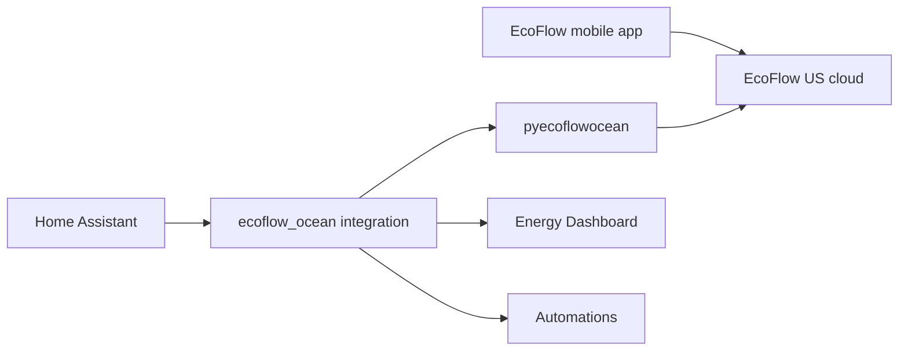

# EcoFlow Power Ocean for Home Assistant

Bring your **EcoFlow Power Ocean** whole-home battery system into Home Assistant for a consolidated energy view and automations.

This is a **standalone project** — separate from [hbx-sensorlinx-ha](https://github.com/andre/hbx-sensorlinx-ha). Community integrations ([tolwi/hassio-ecoflow-cloud](https://github.com/tolwi/hassio-ecoflow-cloud), [niltrip/powerocean](https://github.com/niltrip/powerocean)) do not work for Power Ocean on this hardware, so we reverse-engineer the **EcoFlow mobile app API**.

**v1 scope:** Read-only sensors (battery SOC, solar/grid/home power, status). No backup reserve or work mode controls yet.

## Status

| Phase | State |
|-------|-------|
| Repo scaffold | Done |
| App traffic capture | **Required next step** — see [docs/capture-traffic.md](docs/capture-traffic.md) |
| `pyecoflowocean` client | Scaffolded — awaiting API mapping |
| HA integration | Scaffolded — loads after client is mapped |
| Forest Home deploy | Pending capture + client |

## Project layout

```
ecoflow-ocean-ha/
  pyecoflowocean/              # pip-installable API client
  custom_components/
    ecoflow_ocean/             # Home Assistant integration
  scripts/
    analyze_har.py             # Summarize captured app traffic
    discover_devices.py        # Login + dump telemetry keys
    ha_probe.py                # Check Forest Home HA state
  docs/
    capture-traffic.md         # App-only capture guide
    api-notes.md               # Fill after capture
  dashboards/
    ecoflow-ocean.yaml         # Lovelace template
  automations/
    examples.yaml              # SOC / export / offline alerts
  captures/                    # gitignored HAR files
```

## Phase 1 — Capture the EcoFlow app (blocking)

1. Follow [docs/capture-traffic.md](docs/capture-traffic.md) (**mobile app only**, no web portal).
2. Export HAR → `captures/ecoflow-ocean-YYYYMMDD.har`
3. Run:

```powershell
pip install -r requirements-dev.txt
python scripts/analyze_har.py captures/ecoflow-ocean-YYYYMMDD.har
```

4. Document endpoints in [docs/api-notes.md](docs/api-notes.md).
5. Implement `pyecoflowocean/auth.py` and `client.py`.
6. Verify:

```powershell
$env:ECOFLOW_EMAIL = "you@example.com"
$env:ECOFLOW_PASSWORD = "your-password"
python scripts/discover_devices.py
```

## Phase 2 — Install on Home Assistant

### Copy the integration

```
config/
  custom_components/
    ecoflow_ocean/
      __init__.py
      manifest.json
      ...
```

Ways to install:

- **Samba / File Editor**: paste under `/config/custom_components/`
- **SSH add-on**: `scp -r custom_components/ecoflow_ocean root@homeassistant.local:/config/custom_components/`

### Install pyecoflowocean

Home Assistant needs the library in its Python environment:

```bash
# On HA OS with SSH / Terminal add-on, from this repo:
pip install /config/ecoflow-ocean-ha
# or publish to PyPI and rely on manifest requirements
```

For local development:

```powershell
pip install -e .
```

### Add the integration

1. Restart Home Assistant
2. Settings → Devices & services → Add integration → **EcoFlow Power Ocean**
3. Enter the same email/password as the EcoFlow app
4. Select your Power Ocean inverter serial number

### Forest Home deploy

Target HA: `http://172.16.255.250:8123`

```powershell
$env:HA_TOKEN = "your-long-lived-access-token"
python scripts/ha_probe.py
```

## v1 entities

| Entity | Description |
|--------|-------------|
| `sensor.{sn}_battery_soc` | Battery state of charge (%) |
| `sensor.{sn}_battery_power` | Battery charge/discharge (W) |
| `sensor.{sn}_solar_power` | PV production (W) |
| `sensor.{sn}_grid_power` | Grid import (+) / export (−) (W) |
| `sensor.{sn}_home_power` | Home load (W) |
| `sensor.{sn}_status` | System status text |
| `sensor.{sn}_phase_*` | Per-phase V/A/W if API exposes them |

## Energy Dashboard

The EcoFlow app may expose only **instantaneous power (W)**, not cumulative kWh counters.

If no energy counters are available from the API:

1. Settings → Devices & services → Helpers → **Integration** — create Riemann sum helpers from power sensors, **or**
2. Use the `integration` platform in YAML to derive kWh from W sensors

Then add sources in Settings → Dashboards → Energy:

| Source | Entity |
|--------|--------|
| Solar production | `sensor.{sn}_solar_power` (or kWh helper) |
| Grid consumption | `sensor.{sn}_grid_power` (or kWh helper) |
| Battery | `sensor.{sn}_battery_power` (or kWh helper) |

Import the Lovelace dashboard from [dashboards/ecoflow-ocean.yaml](dashboards/ecoflow-ocean.yaml) (replace `YOUR_SN`).

## Automation examples

See [automations/examples.yaml](automations/examples.yaml):

- Low battery SOC alert (&lt; 20%)
- Grid export notification (export &gt; 500 W for 5 min)
- System offline alert (status unavailable &gt; 10 min)

## Architecture



## HACS install (optional)

This repo includes `hacs.json`. Add it as a custom repository in HACS after publishing to GitHub.

## Development

```powershell
pip install -r requirements-dev.txt
pip install -e .
```

## License

MIT
